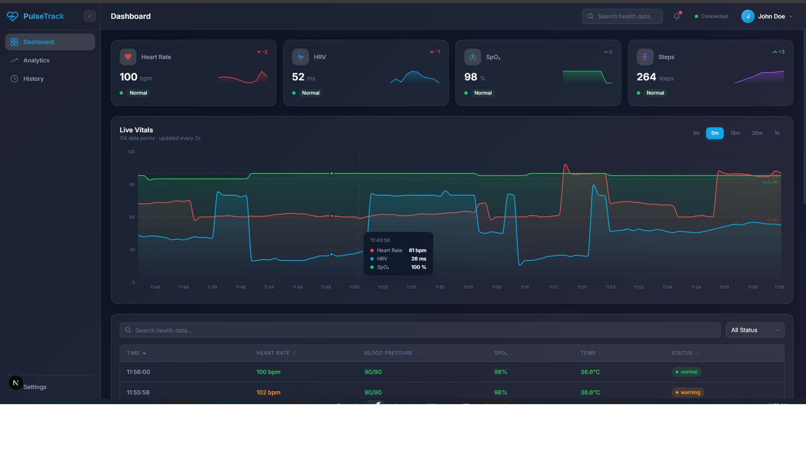
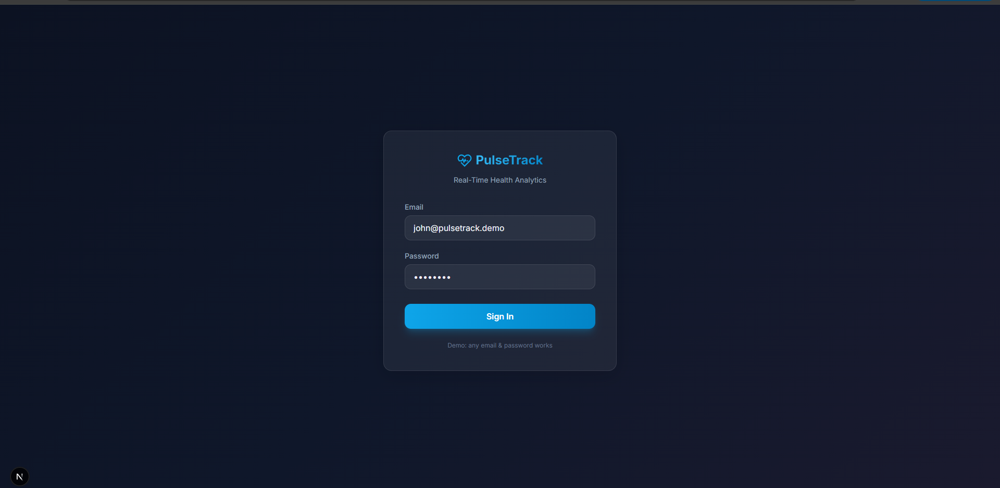

# PulseTrack 💟

A modern, real-time health monitoring dashboard built with Next.js, featuring a clean SaaS aesthetics, glassmorphism design, real-time WebSocket data simulation, and comprehensive offline support.




## ✨ Features

- **Real-Time Data Streaming**: Simulates a live WebSocket connection pushing health vitals (Heart Rate, Blood Pressure, SpO2) every 2 seconds.
- **Offline Support & Sync**: Uses `idb-keyval` and `navigator.onLine` to detect network drops, cache real-time readings in IndexedDB, and automatically flush them to the server upon reconnection.
- **Glassmorphism UI**: High-end, custom-built UI with blurred backdrops, smooth gradients, and interactive components using pure CSS variables and Tailwind CSS.
- **Interactive Charts**: Performance-optimized, responsive Recharts line chart with time-range filtering (1m, 5m, 15m, 30m, 1h) and custom tooltip styles.
- **Sortable & Filterable Data Table**: A robust activity log table featuring debounced search, status-based filtering (Normal, Warning, Critical), column sorting, and pagination.
- **Animations & Micro-interactions**: Fluid transitions, hover effects, and spring-based number animations powered by Framer Motion. Respects `prefers-reduced-motion` for accessibility.
- **Authentication**: JWT-based mock authentication flow with React-Redux state management, route guards, and local storage retention.
- **Progressive Web App (PWA)**: Includes a Service Worker (`sw.js`) and `manifest.json` for installability, offline caching, and native-like app experiences.

## 🛠️ Tech Stack

- **Framework**: [Next.js 15](https://nextjs.org/) (App Router, Turbopack)
- **UI Library**: [React 19](https://react.dev/)
- **Styling**: [Tailwind CSS v4](https://tailwindcss.com/) + Custom CSS Properties
- **State Management**: [Redux Toolkit](https://redux-toolkit.js.org/) (`@reduxjs/toolkit`, `react-redux`)
- **Animation**: [Framer Motion](https://www.framer.com/motion/)
- **Data Visualization**: [Recharts](https://recharts.org/)
- **Offline Storage**: [IndexedDB (idb-keyval)](https://github.com/jakearchibald/idb-keyval)
- **Type Checking**: [TypeScript](https://www.typescriptlang.org/)

## 🚀 Getting Started

### Prerequisites

- Node.js (v18.x or newer recommended)
- npm or yarn

### Installation

1. **Clone the repository:**
   ```bash
   git clone https://github.com/yourusername/pulsetrack.git
   cd pulsetrack
   ```

2. **Install dependencies:**
   ```bash
   npm install
   # or
   yarn install
   ```

3. **Start the development server:**
   ```bash
   npm run dev
   # or
   yarn dev
   ```

4. **Open your browser:**
   Navigate to [http://localhost:3000](http://localhost:3000). You'll be presented with the login screen. You can log in using any email/password combination as it's a simulated environment.

## 🌐 Live Demo

👉 https://pulse-track-teal.vercel.app/

## 🔑 Demo Login

You can use any email/password combination.
Authentication is simulated for demonstration purposes.

## 📂 Project Structure

- `src/app/` - Next.js App Router structure (login, dashboard, 404).
- `src/components/` - Reusable UI elements, categorized by domain (`layout`, `metrics`, `charts`, `tables`, `ui`).
- `src/features/` - Redux slices and domain-specific hooks (`auth`, `health`).
- `src/hooks/` - Generic custom React hooks (`useDebouncedValue`, `useThrottledValue`, `useOnlineStatus`).
- `src/services/` - Simulated API layers and the `MockWebSocket` connection.
- `src/store/` - Redux store configuration and middleware.
- `src/lib/` - Utility wrappers (e.g., IndexedDB abstractions, Token management).
- `src/utils/` - Helpers, formatters, simulated data generators, and constants.

## 🧪 Testing Offline Mode

To test the resilience of the application:
1. Log into the dashboard and ensure metrics are updating via the simulated WebSocket.
2. Open your browser's Developer Tools.
3. Go to the **Network** tab and change throttling to **Offline**.
4. Observe the offline banner slide down. Your real-time metrics will still update but will be cached into IndexedDB.
5. In your DevTools, switch back to **No throttling** (Online).
6. Observe the app automatically reconnecting, the offline banner sliding up, and the background synchronization syncing the cached data!

## 🤝 Contributing

Contributions, issues, and feature requests are welcome! Feel free to check the [issues page](https://github.com/yourusername/pulsetrack/issues).

## 📄 License

This project is open-source and available under the [MIT License](LICENSE).
